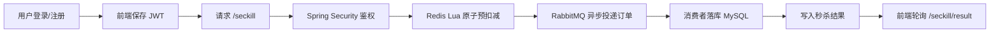

# Shopping System

一个面向练手、演示和简历展示的企业级秒杀系统示例项目，完整覆盖了 `注册登录 -> JWT 鉴权 -> Redis 预扣库存 -> RabbitMQ 异步下单 -> MySQL 落库 -> 前端结果反馈` 的核心链路。


[](LICENSE)

---

## 目录

- [功能特性](#功能特性)
- [技术栈](#技术栈)
- [快速开始](#快速开始)
  - [前置要求](#前置要求)
  - [本地运行](#本地运行)
  - [Docker 运行](#docker-运行)
- [配置](#配置)
- [项目结构](#项目结构)
- [架构概览](#架构概览)
- [API 示例](#api-示例)
- [测试](#测试)
- [部署](#部署)
- [贡献指南](#贡献指南)
- [行为准则](#行为准则)
- [版本与变更记录](#版本与变更记录)
- [许可证](#许可证)
- [致谢 & 资源](#致谢--资源)

---

## 功能特性

- 用户注册、登录、JWT 鉴权、登录态校验全部打通，未登录用户无法进入秒杀页面。
- Redis Lua 脚本实现库存原子预扣减，并在请求入口阶段拦截重复下单。
- RabbitMQ 异步下单，消费者异步扣减数据库库存并写入订单表。
- 秒杀结果支持前端轮询反馈，用户可以看到排队中、成功、售罄等最终状态。
- 秒杀页面显示实时库存，直接基于 Redis 当前库存同步，库存变化可见。
- 支持本地一键启动、本地开发模式、Docker 一键部署三种使用方式。
- 已补齐统一接口返回、全局异常处理、限流、本地验收脚本、健康检查等工程化能力。

## 技术栈

- 后端：Spring Boot 3.2、Spring Security、Spring JDBC、Spring AMQP、Spring Data Redis、Actuator、JWT
- 前端：React 18、Vite 4
- 数据层：MySQL 8、Redis 7、RabbitMQ 3
- 部署与开发：Docker、Docker Compose、Maven Wrapper、Nginx

---

## 快速开始

### 前置要求

推荐安装：

- `Git`
- `Docker Desktop`
- `JDK 17`
- `Node.js 18+`
- `IntelliJ IDEA` 或 `VS Code`

说明：

- `Maven` 不需要单独安装，项目已内置 [mvnw](/Users/zhengwenze/Desktop/codex/shopping--system/backend/mvnw)
- `MySQL`、`Redis`、`RabbitMQ` 不建议本机裸装，统一使用 Docker

### 本地运行

本项目提供两种本地运行方式。

#### 方式一：本地一键启动到可验收

这是最推荐的新手使用方式，适合直接在本机拉起整套环境并验收。

启动：

```bash
./scripts/local-up.sh
./scripts/local-check.sh
```

停止：

```bash
./scripts/local-down.sh
```

特点：

- 自动寻找空闲端口，规避本机已有服务冲突
- 自动启动 MySQL、Redis、RabbitMQ、后端、前端
- 自动等待后端健康检查与前端页面可访问
- 自动验收注册、登录、库存查询、未登录拦截、首次秒杀、重复下单拦截、秒杀结果反馈、库存变化

默认会输出类似地址：

- 前端：`http://localhost:3001` 或脚本自动避让后的端口
- 后端：`http://localhost:8081` 或脚本自动避让后的端口
- RabbitMQ 管理台：`http://localhost:15673` 或脚本自动避让后的端口

#### 方式二：本地开发模式

适合日常调试，特点是中间件容器化，前后端本机运行。

1. 启动中间件

```bash
docker compose -f docker-compose.dev.yml up -d
```

2. 启动后端

```bash
cd backend
./mvnw -Dmaven.test.skip=true -Dspring-boot.run.useTestClasspath=false spring-boot:run -Dspring-boot.run.profiles=dev
```

3. 启动前端

```bash
cd frontend
npm install
npm run dev
```

本地开发模式下默认端口：

- MySQL：`3306`
- Redis：`6379`
- RabbitMQ：`5672`
- RabbitMQ 控制台：`15672`
- 后端：`8080`
- 前端：`3000`

### Docker 运行

如果你希望直接一键构建并运行完整部署态环境，可以执行：

```bash
docker compose up -d --build
```

访问地址：

- 前端：`http://localhost:3000`
- 后端：`http://localhost:8080`
- 健康检查：`http://localhost:8080/actuator/health`
- RabbitMQ 控制台：`http://localhost:15672`

这个模式更适合演示、交付和部署验证。

---

## 配置

项目当前包含三套核心配置：

- 公共配置：[backend/src/main/resources/application.yml](/Users/zhengwenze/Desktop/codex/shopping--system/backend/src/main/resources/application.yml)
- 本地开发配置：[backend/src/main/resources/application-dev.yml](/Users/zhengwenze/Desktop/codex/shopping--system/backend/src/main/resources/application-dev.yml)
- 容器运行配置：[backend/src/main/resources/application-docker.yml](/Users/zhengwenze/Desktop/codex/shopping--system/backend/src/main/resources/application-docker.yml)

关键配置项说明：

| 配置项 | 作用 | 默认值 |
| --- | --- | --- |
| `app.jwt.secret` | JWT 签名密钥 | `shopping-system-demo-secret-key-please-change` |
| `app.jwt.expiration-minutes` | JWT 过期时间 | `120` |
| `app.cors.allowed-origins` | 前端允许访问源 | `http://localhost:*` 等 |
| `app.seckill.rate-limit.window-seconds` | 限流窗口秒数 | `5` |
| `app.seckill.rate-limit.max-requests` | 限流窗口内最大请求数 | `5` |

数据库初始化脚本：

- [backend/src/main/resources/schema.sql](/Users/zhengwenze/Desktop/codex/shopping--system/backend/src/main/resources/schema.sql)
- [docker/mysql/init/01-schema.sql](/Users/zhengwenze/Desktop/codex/shopping--system/docker/mysql/init/01-schema.sql)

前端代理配置：

- Vite 开发代理：[frontend/vite.config.js](/Users/zhengwenze/Desktop/codex/shopping--system/frontend/vite.config.js)
- Nginx 部署代理：[frontend/nginx.conf](/Users/zhengwenze/Desktop/codex/shopping--system/frontend/nginx.conf)

---

## 项目结构

```text
shopping--system/
├── backend/                       # Spring Boot 后端
│   ├── src/main/java/com/shopping/
│   │   ├── common/                # 统一响应、错误码、Redis key
│   │   ├── config/                # CORS、库存预热等配置
│   │   ├── controller/            # 登录注册、秒杀接口
│   │   ├── exception/             # 业务异常、全局异常处理
│   │   ├── interceptor/           # 限流拦截器
│   │   ├── model/                 # 请求/响应/实体模型
│   │   ├── mq/                    # RabbitMQ 配置和消费
│   │   ├── security/              # JWT、过滤器、安全配置
│   │   ├── service/               # 业务逻辑
│   │   └── ShoppingSystemApplication.java
│   ├── src/main/resources/
│   │   ├── application.yml
│   │   ├── application-dev.yml
│   │   ├── application-docker.yml
│   │   └── schema.sql
│   ├── Dockerfile
│   └── mvnw
├── frontend/                      # React + Vite 前端
│   ├── src/
│   │   ├── App.jsx                # 登录/注册首页与登录后主界面
│   │   ├── SeckillButton.jsx      # 秒杀卡片、结果与库存展示
│   │   └── index.jsx
│   ├── Dockerfile
│   ├── nginx.conf
│   └── vite.config.js
├── docker/
│   └── mysql/init/                # MySQL 初始化脚本
├── doc/                           # 项目说明文档
├── scripts/                       # 本地一键启动、停止、验收脚本
├── docker-compose.dev.yml         # 本地开发中间件编排
├── docker-compose.local.yml       # 零本机依赖开发编排
├── docker-compose.yml             # 完整部署编排
└── README.md
```

---

## 架构概览

### 业务链路



### 核心设计说明

- 鉴权：前端通过 `/auth/register` 或 `/auth/login` 获取 JWT，后续请求统一带 `Authorization: Bearer <token>`
- 秒杀入口：接口层不再信任前端传来的 `userId`，统一从 JWT 中解析当前用户身份
- 库存处理：Redis Lua 负责原子扣减与重复下单拦截，减少高并发下数据库写压力
- 异步下单：RabbitMQ 负责削峰，消费者最终扣减数据库库存并创建订单
- 结果反馈：Redis 保存用户秒杀结果状态，前端轮询显示 `QUEUED`、`SUCCESS`、`SOLD_OUT`
- 实时库存：前端轮询 `/seckill/stock`，库存直接读取 Redis 当前值

### 关键实现文件

- 鉴权入口：[backend/src/main/java/com/shopping/controller/AuthController.java](/Users/zhengwenze/Desktop/codex/shopping--system/backend/src/main/java/com/shopping/controller/AuthController.java)
- 鉴权服务：[backend/src/main/java/com/shopping/service/AuthService.java](/Users/zhengwenze/Desktop/codex/shopping--system/backend/src/main/java/com/shopping/service/AuthService.java)
- 安全配置：[backend/src/main/java/com/shopping/security/SecurityConfig.java](/Users/zhengwenze/Desktop/codex/shopping--system/backend/src/main/java/com/shopping/security/SecurityConfig.java)
- JWT 过滤器：[backend/src/main/java/com/shopping/security/JwtAuthenticationFilter.java](/Users/zhengwenze/Desktop/codex/shopping--system/backend/src/main/java/com/shopping/security/JwtAuthenticationFilter.java)
- 秒杀控制器：[backend/src/main/java/com/shopping/controller/SeckillController.java](/Users/zhengwenze/Desktop/codex/shopping--system/backend/src/main/java/com/shopping/controller/SeckillController.java)
- 秒杀服务：[backend/src/main/java/com/shopping/service/SeckillService.java](/Users/zhengwenze/Desktop/codex/shopping--system/backend/src/main/java/com/shopping/service/SeckillService.java)
- 异步消费者：[backend/src/main/java/com/shopping/mq/OrderConsumer.java](/Users/zhengwenze/Desktop/codex/shopping--system/backend/src/main/java/com/shopping/mq/OrderConsumer.java)
- 登录页与主页面：[frontend/src/App.jsx](/Users/zhengwenze/Desktop/codex/shopping--system/frontend/src/App.jsx)
- 秒杀按钮与库存展示：[frontend/src/SeckillButton.jsx](/Users/zhengwenze/Desktop/codex/shopping--system/frontend/src/SeckillButton.jsx)

---

## API 示例

以下示例均假设后端运行在 `http://localhost:8080`。

### 1. 用户注册

```bash
curl -X POST http://localhost:8080/auth/register \
  -H "Content-Type: application/json" \
  -d '{
    "username": "demo_user",
    "password": "Passw0rd!"
  }'
```

示例响应：

```json
{
  "code": 0,
  "message": "注册成功",
  "data": {
    "token": "jwt-token",
    "tokenType": "Bearer",
    "expiresInSeconds": 7200,
    "user": {
      "id": 1772815095483011,
      "username": "demo_user"
    }
  }
}
```

### 2. 用户登录

```bash
curl -X POST http://localhost:8080/auth/login \
  -H "Content-Type: application/json" \
  -d '{
    "username": "demo_user",
    "password": "Passw0rd!"
  }'
```

### 3. 查询当前用户

```bash
curl http://localhost:8080/auth/me \
  -H "Authorization: Bearer <token>"
```

### 4. 查询实时库存

```bash
curl "http://localhost:8080/seckill/stock?productId=1" \
  -H "Authorization: Bearer <token>"
```

示例响应：

```json
{
  "code": 0,
  "message": "库存查询成功",
  "data": {
    "productId": 1,
    "remainingStock": 100,
    "soldOut": false
  }
}
```

### 5. 发起秒杀

```bash
curl -X POST "http://localhost:8080/seckill?productId=1" \
  -H "Authorization: Bearer <token>"
```

### 6. 查询秒杀结果

```bash
curl "http://localhost:8080/seckill/result?productId=1" \
  -H "Authorization: Bearer <token>"
```

常见状态值：

- `QUEUED`：排队处理中
- `SUCCESS`：秒杀成功
- `SOLD_OUT`：已售罄
- `NOT_FOUND`：当前用户尚未发起秒杀

---

## 测试

当前项目没有补完整的自动化单元测试和集成测试，但已经提供了可执行的构建与验收命令。

### 后端编译验证

```bash
cd backend
./mvnw -q -DskipTests package
```

### 前端构建验证

```bash
cd frontend
npm install
npm run build
```

### 本地全链路验收

```bash
./scripts/local-up.sh
./scripts/local-check.sh
```

`local-check.sh` 当前会校验：

- 注册接口可用
- 登录接口可用
- JWT 鉴权正常
- 未登录访问秒杀接口被拦截
- 实时库存接口可用
- 首次秒杀成功进入排队
- 重复下单保护生效
- 秒杀结果反馈为最终成功
- 秒杀前后库存值发生变化
- 前端代理请求链路可用

---

## 部署

### 方案一：Docker Compose 一键部署

适合本地演示或轻量环境交付。

```bash
docker compose up -d --build
```

对应编排文件：

- [docker-compose.yml](/Users/zhengwenze/Desktop/codex/shopping--system/docker-compose.yml)

### 方案二：零本机依赖开发部署

适合只安装 Docker Desktop 的本地环境。

```bash
docker compose -f docker-compose.local.yml up --build
```

对应编排文件：

- [docker-compose.local.yml](/Users/zhengwenze/Desktop/codex/shopping--system/docker-compose.local.yml)

### 部署建议

- 生产环境请替换 `app.jwt.secret`
- 建议将数据库、Redis、RabbitMQ 地址改成云服务或独立基础设施
- 建议增加数据库迁移工具，例如 Flyway 或 Liquibase
- 建议补充 CI/CD、日志采集、指标监控、告警和链路追踪

---

## 贡献指南

如果你继续迭代这个项目，建议遵循以下规则：

- 每次变更保持单一逻辑目标，避免把 UI、文档、后端逻辑混在一个提交里
- 提交说明使用清晰的中文动词短句，例如“新增 JWT 鉴权链路”
- 修改前优先阅读相关模块代码，避免破坏当前可运行链路
- 修改后至少执行一次构建或本地验收脚本

推荐优先迭代方向：

1. 单元测试与集成测试
2. 用户中心与订单查询
3. 更完整的风控能力，例如验证码、黑名单、熔断
4. CI/CD 与容器镜像发布
5. Prometheus/Grafana 监控与日志追踪

## 行为准则

- 保持提交粒度清晰，避免大批量无语义提交
- 不在未确认的情况下移除现有可运行功能
- 优先保证本地可启动、可验收、可复现
- 文档与代码保持同步更新

## 版本与变更记录

当前仓库已完成的关键里程碑包括：

- Docker 化与一键启动链路补齐
- 开发态 / 容器态配置拆分
- 统一接口返回与全局异常处理
- 用户维度限流与防重复下单
- JWT 注册登录与登录后访问控制
- 秒杀结果反馈与实时库存展示
- 登录页 UI 重构与本地验收脚本增强

你可以通过 Git 历史查看详细过程：

```bash
git log --oneline --decorate
```

## 许可证

本项目采用 [MIT License](/Users/zhengwenze/Desktop/codex/shopping--system/LICENSE)。

## 致谢 & 资源

- Spring Boot 官方文档
- Spring Security 官方文档
- React 官方文档
- Vite 官方文档
- Redis Lua 脚本机制
- RabbitMQ 官方文档

仓库地址：

- [GitHub - zhengwenze/shopping--system](https://github.com/zhengwenze/shopping--system)
